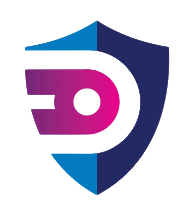

  

<b> Submission for Zeta Hacks 3.0</b>

---

- [Video Link](https://youtu.be/hGGFfQjj1wA)
- [PPT Link](https://kietechnology-my.sharepoint.com/:p:/g/personal/rohan_1822cs1112_kiet_edu/EeeGW3Cziz1IoyDb8-wM9LYBoOGDDLWcDwcRFC-Gx67uWg?e=6D7w2t)
- [DEMO Link](http://kawachtecharmy.pythonanywhere.com/)

---

## Problem

Phone scams are the most common scams used against the elderly as wells as kids. Scammers might get seniors to wire or send them money by claiming to be a family member who is in trouble and needs money. They might also solicit money from the elderly by posing as a fake charity.​

Need to Build a secure solution that double authenticate or helps you in monitoring any transaction made by any senior, kid.

## Solution

- Kawach is smart and easy to use payment application that equipped with features to provide secure transactions using double authentication shield.

- Introducing the feature of trusted contacts, sharing a fund space among family members and trusted contacts and many more.

- Protecting users from payment scams and fake charity.

- Providing feature for users to request money from a friend.

## Features

- Secure Account Creation
- Add Trusted Contacts
- Request Money From Friend
- View Transaction Record and History
- Share Funds with Your Family Members

## Instructions to Run the Demo

- Clone the Repository
- Move to the src folder `cd src`
- Install dependencies `pip install -r requirements.txt`
- In terminal or cmd prompt run `python manage.py runserver` and visit the URL prompted in shell.

## Team
<table>
  <tr>
    <th colspan=4>TechArmy</th>
  </tr>
  <tr>
    <td>
      
    </td>
    <td>
      
    </td>
    <td>
      
    </td>
    <td>
      
    </td>
  </tr>
  <tr>
    <td>
      <a href="https://github.com/rohan-khurana/">Rohan Khurana
    </td>
    <td>
      <a href="https://github.com/tushar5526">Tushar Gupta
    </td>
    <td>
      <a href="https://github.com/SanchitaMishra170676">Sanchita Mishra
    </td>
    <td>
      <a href="https://github.com/thisisKushagraGoel">Kushagra Goel
    </td>
  </tr>
</table>
